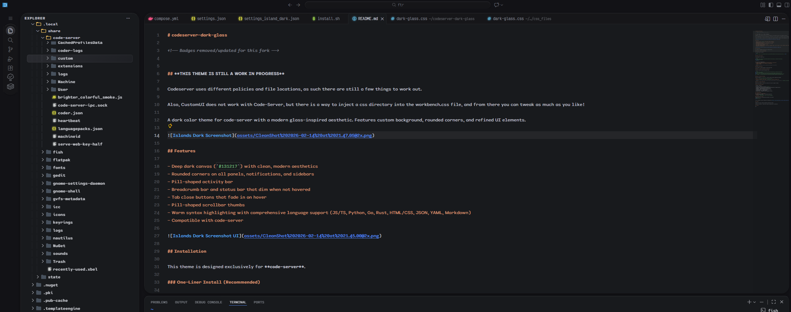

# codeserver-dark-glass

## **THIS THEME IS STILL A WORK IN PROGRESS**

Codeserver uses different policies and file locations, as such there are still a few things to work out. 

Also, CustomUI does not work with Code-Server, but there is a way to inject a css directory into the workbench.css file, and from there you can tweak as much as you like!

A dark color theme for code-server with a modern glass-inspired aesthetic. Features custom background, rounded corners, and refined UI elements.



## Features

- Deep dark canvas (`#131217`) with clean, modern aesthetics
- Rounded corners on all panels, notifications, and sidebars
- Pill-shaped activity bar
- Breadcrumb bar and status bar that dim when not hovered
- Tab close buttons that fade in on hover
- Pill-shaped scrollbar thumbs
- Warm syntax highlighting with comprehensive language support (JS/TS, Python, Go, Rust, HTML/CSS, JSON, YAML, Markdown)
- Compatible with code-server


## Installation

This theme is designed exclusively for **code-server**.

### One-Line Automatic Install

The fastest way to install:

```bash
curl -fsSL https://raw.githubusercontent.com/acester822/codeserver-dark-glass/main/install.sh | bash
```

The script will automatically:
- ✅ Install the codeserver-dark-glass theme extension to code-server
- ✅ Merge settings into your code-server configuration
- ✅ Apply the theme

> **Note:** code-server must be installed and available in your PATH.
>
> If not installed, install code-server following the [official instructions](https://coder.com/docs/code-server/install).

## What the theme includes

| Element | Feature |
|---------|---------|
| **Canvas** | Deep dark background (`#131217`) |
| **Color Theme** | Warm syntax highlighting with comprehensive language support |
| **Sidebar** | Rounded corners and clean styling |
| **Editor** | Modern appearance with refined UI |
| **Activity bar** | Pill-shaped design |
| **Command palette** | Clean, easy-to-read styling |
| **Scrollbars** | Pill-shaped thumbs |
| **Status bar** | Dimmed text that brightens on hover |

## Troubleshooting

### Changes aren't taking effect
Try refreshing your browser or restarting code-server:
- Refresh: `Ctrl+Shift+R`
- Or restart: `sudo systemctl restart code-server@$USER`

### Code-server not found
Ensure code-server is installed and available in your PATH:
```bash
which code-server
```


## Credits

Adapted from https://github.com/bwya77/vscode-dark-islands

Inspired by JetBrains' Islands Dark theme and modernized for code-server.

## License

MIT

